# Flip Game
(by Morgan Jenkins)

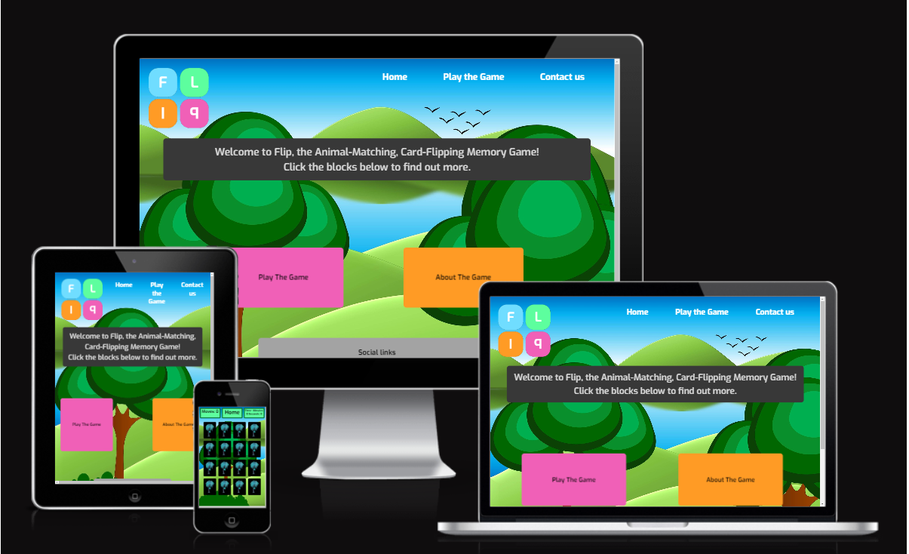

[Live Website](https://jenkidev.github.io/Milestone_project_2/)
## Table of Contents

1. [Project Goals](#project-goals)
    1. [User Goals](#user-goals)
    2. [Site Owner Goals](#site-owner-goals)
2. [User Experience](#user-experience)
    1. [Target Audience](#target-audience)
    2. [User Requirements and Expectations](#user-requrements-and-expectations)
    3. [User Stories](#user-stories)
    4. [Scope](#scope)
3. [Design of Site](#design-of-site)
    1. [Initial Idea](#initial-idea)
    2. [Wireframes](#wireframes)
    3. [Site Layout](#site-layout)
    4. [Colour Choices](#colour-choices)
    5. [Fonts](#fonts)
4. [Technologies Implemented](#technologies-implemented)
    1. [Languages](#languages)
    2. [Tools](#tools)
5. [Site Features](#site-features)
6. [Testing](#testing)
    1. [Validation](#validation)
        1. [HTML Validation](#html-validation)
        2. [CSS Validation](#css-validation)
        3. [JavaScript Validation](#javascript-validation)
    2. [Performance and Accessibility](#performance-and-accessibility)
    3. [Device Tests](#device-tests)
    4. [Responsiveness](#responsiveness)
    5. [User Story Tests](#user-story-tests)
7. [Bug Squashing](#bug-squashing)
8. [Deployment](#deployment)
    * [Deploying to Github Pages](#deploying-to-github-pages)
    * [Forking the githubrepository](#forking-the-github-repository)
    * [Cloning the repository](#cloning-the-github-repository)
9. [Credits](#credits)
10. [Thank You](#thank-you)

## Project Goals

### User Goals
- Play the Flip card memory game.
- Experience different levels of challenge.
- Track their previous scores including time and number of moves.
- Contact the site owner to suggest improvements or report issues.
### Site Owner Goals
- Allow the users to play the Flip card game.
- Receive suggestions and issue reports from players.
- Create an engaging and interactive experience for players.  

## User Experience

### Target Audience
- People who enjoy cognitive memory games.
- People who enjoy escalating levels of challenge.
- Young Ages to Old.

### User Requirements and Expectations
- Easy to navigate site and intuitive design.
- Clear and simple to follow instructions.
- Responsive design that adapts to mobile, tablet and desktop.
- Easy to fill out contact form.

### User Stories
#### First-time User 
1. I want to play the Flip card memory game.
2. I want to save my result upon completion.
3. I want to see my results.
4. I want to contact the creator of the site.

#### Returning User
5. I want to see my previous scores for all difficulty levels.
6. I want to be able to see if I can improve my previous score.
7. I want to be able to contact the creator of the site if I encounter any issues.

#### Site Owner 
8. I want users to be able to play the Flip Card game on mobile, tablet and desktop.
9. I want users to be able to save their previous results for all difficulty levels.
10. I want users to be able to see their previous scores for all difficulty levels.
11. I want users to be able to contact me with suggestions and issue reports.
12. I want users to navigate the site without using the browser back button.

## Scope

The scope of the project in it’s first release is defined by the following features:

- Landing page with an interactive menu to select sections of the game (Instructions, Contact Form, Scores and Play button).
- Allow a user to see their previous results.
- Fully functional contact form with emailJS that will not submit unless all fields are filled out.
- A 404 error page that is styled and allows navigation back to the main page.
- Clear favicon that shows the site logo.

## Design of Site

### Initial idea
The initial design idea of the site is to create a simple memory card flipping game for a user to have fun with. The focus of the site is to be on the game and so I will create a simple hosting site which does not distract from the purpose. To keep within the theme of the card flipping all options on the scrolling webpage will be contained within card flipping containers to allow the interactivity to extend beyond the game. The site will be designed to be accessible to both children and adults.

### Wireframes

To create the wireframes I used [Figma.com](https://www.figma.com/). I found this service quite useful over other wireframing services as it allowed a much deeper design experience compared to similar services which allowed me to create a clear design scheme to follow for the project.

The Mobile site was designed to be a vertically scrolling page as it is more consistent with how most would use that device (portrait-mode).

Mobile wireframe Home page (Unclicked)

 

Below you will see the rough content of the menu card divs which is kept consistent across all of the device types and so will not be shown again.

Mobile wireframe Home page (Clicked)

 

For Desktop and Tablet, I felt there as the surface area of the screen is a little more akin to a square setting the menu cards out as a grid made more logistical sense in terms of using screen real estate. Therefore the design for both devices is similar.

Desktop and tablet wireframe Home page
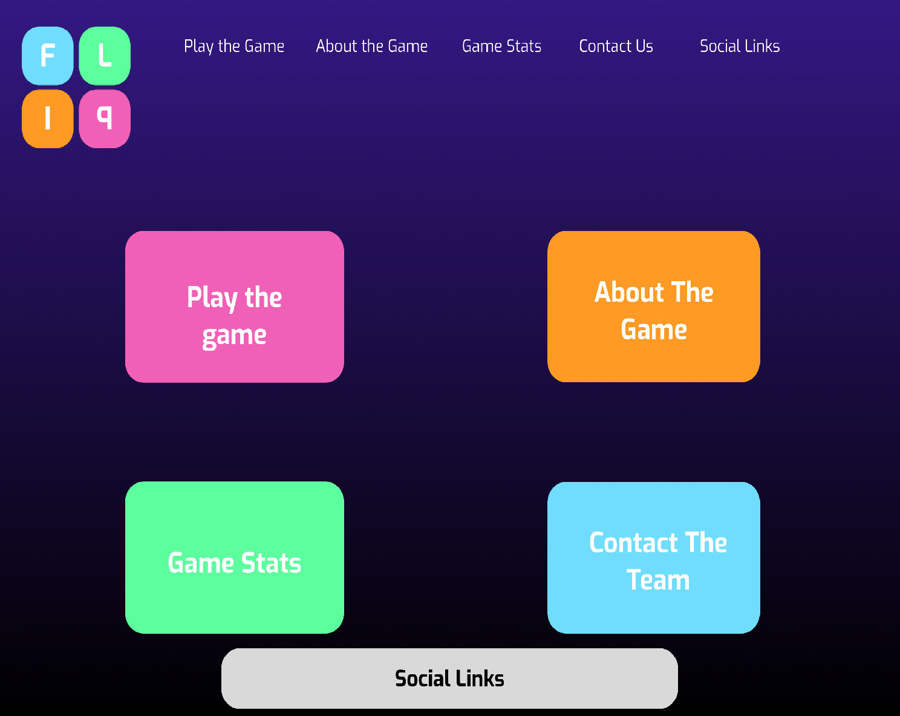
 

The design for the Game pages are all quite similar regardless of the device. This was I wanted to keep the interactive experience of the website consistent regardless of the device. This would allow the same user to use a new device and have the same experience.

Mobile wireframe Game page
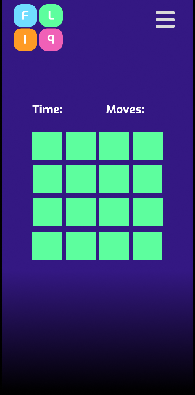
 

Tablet wireframe Game page
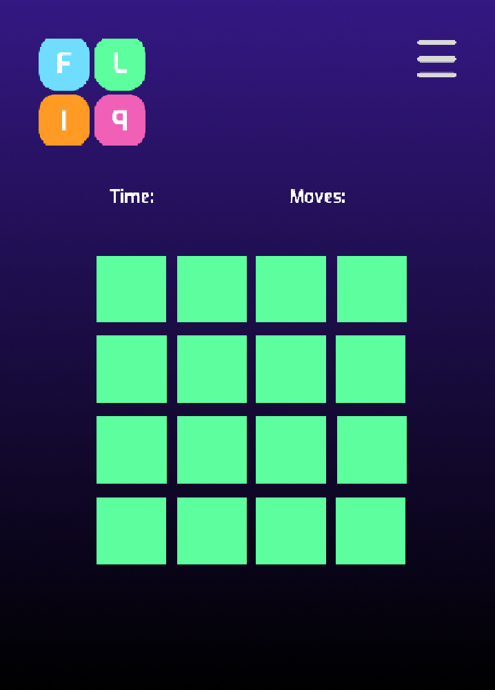
 

Desktop wireframe Game page
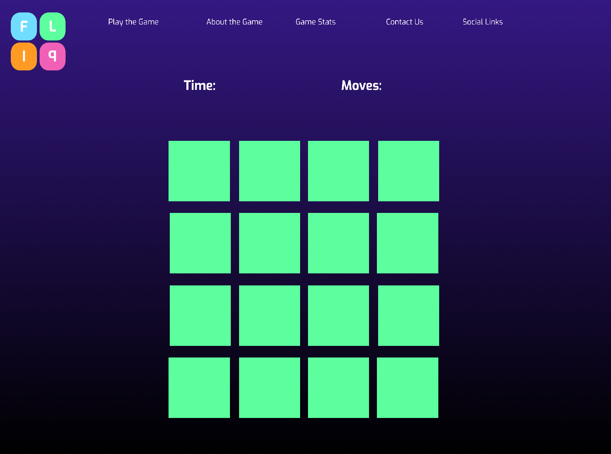
 

### Site Layout

The site as designed will be composed of two pages which will be the home landing page and the game page:

* Home page

    This page will be composed of a banner at the top which will contain the logo for the site along with the navigation bar that will allow the user to access the other sections of the site without using the forward or back button on the browser. Below this in the main body of the page will be divs that behave like the flip cards in the game. Each of these divs will be relevent to a section of the website specifically; a div to play the game, a div to find out about the game, a div to see previous scores, a div to contact the website owner and a div to access social media (in an actual release this would connect to pages setup relevent to the website, at present they just connect to the social media home page).

* Game Page

    This page will have the same banner as the Home page to keep consistent across the site. Below the banner will be a section where the number of moves taken during the game and the time taken to complete the game will be tracked. Below that will be the section where the memory cards will be and arranged in a grid. 

### Colour Choices

Below you will see the main colours selected for this webpage, these were selected for both the logo and the divs as they were clear complementary colours and the pastel theme I felt made it more accessible for younger children which was the main target audience. This was backed up by the darker purple which contrasted with the divs quite effectively and was given a linear gradient as the solid fill looked too stark on the page. The text colour was selected to be a white as this would keep the page looking bright and vibrant.

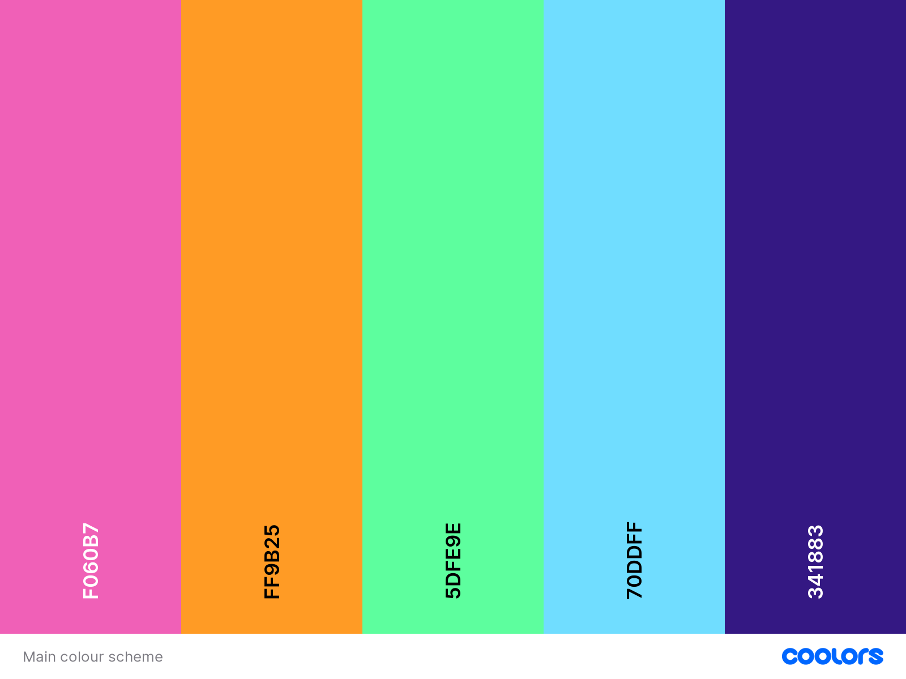
### Fonts

The font used for the site is the "Exo" font as this had quite a bold and easy to read style whilst also being curved, thus giving the website an approachable feel. I also provided "sans serif" as a backup as it also clear and legible though not as styled.
## Technologies Implemented

### Languages

* HTML
* CSS
* JavaScript
### Tools

* Figma - Used to develop the wireframes and create the site logo.
* Favicon.io - Used to create favicon for site and generate files to implement.
* Adobe Cloud - Used to generate Gifs of site functions.
* Git and Github - Used for version control and hosting.
* Gitpod - Used as an IDE.
* Google Fonts - Used to generate custom fonts for the website. 
* Responsinator.com- Used to assess responsiveness across a large device array and orientations.
## Site Features

N.B. The site has gone through some revision. During the course of the project I fell quite ill and had to cut back on several features due to time crunch but still endeavoured to follow a minimal viable product approach. These changes will be detailed in the user stories testing section.
## Testing
    
### Validation

#### HTML Validation- W3C markup validation service was used to assess the validity of my HTML code.

HTML Validation of Home Page

 

HTML Validation of Game Page
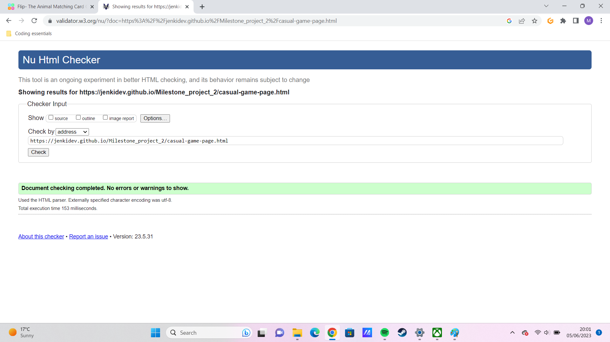
 

HTML Validation of Contact Page

 

HTML Validation of 404 Page
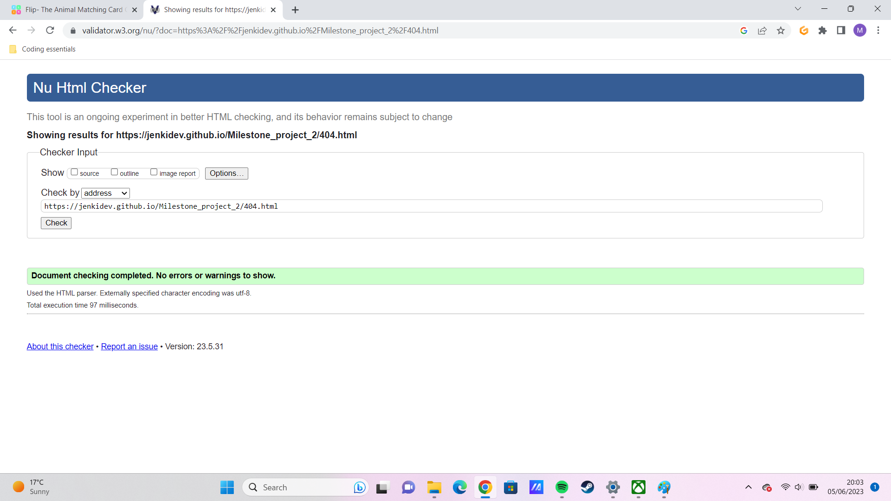
 

#### CSS Validation- W3C CSS validation service was used to assess the validity of my CSS code

CSS Validation of Home Page
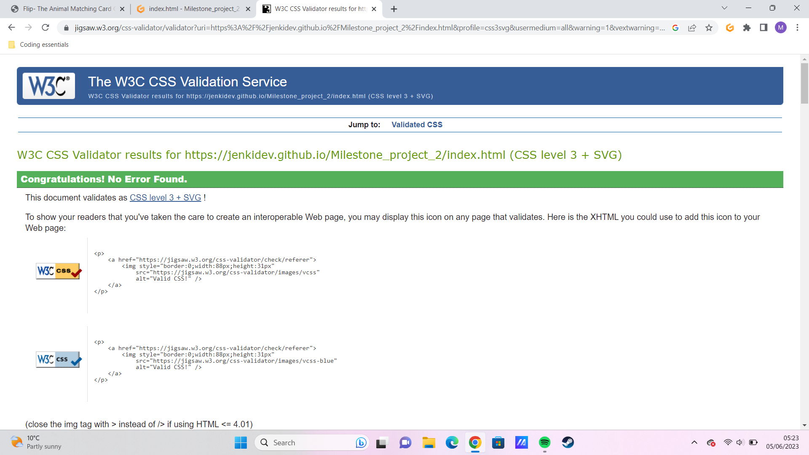
 

CSS Validation of Game Page
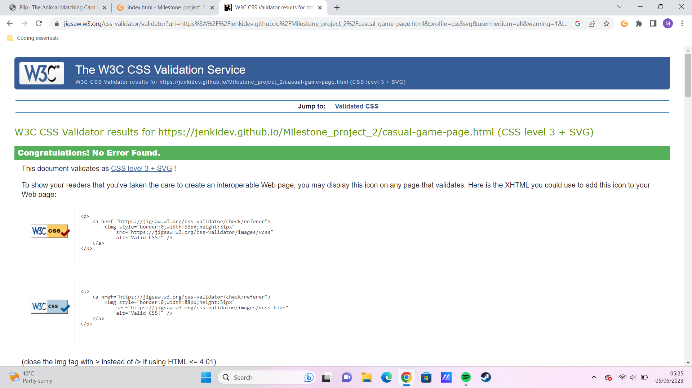
 

CSS Validation of Contact Page
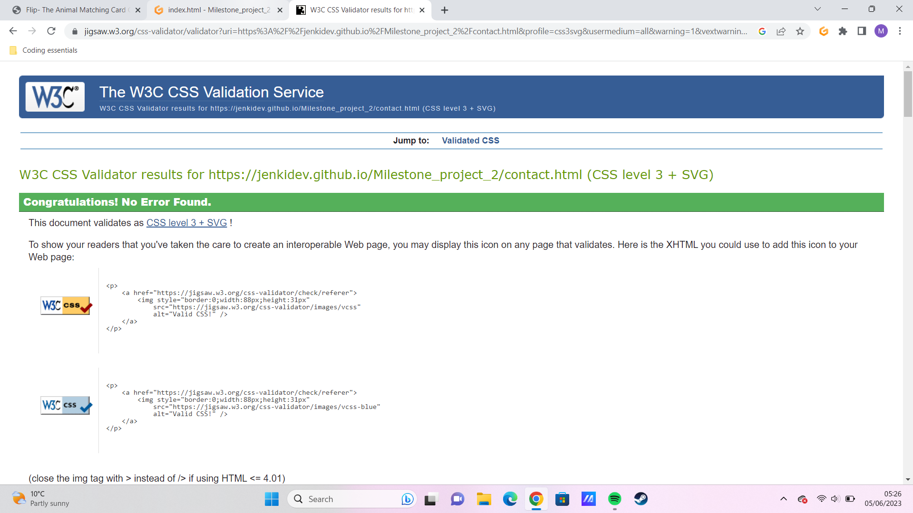
 

CSS Validation of 404 Page
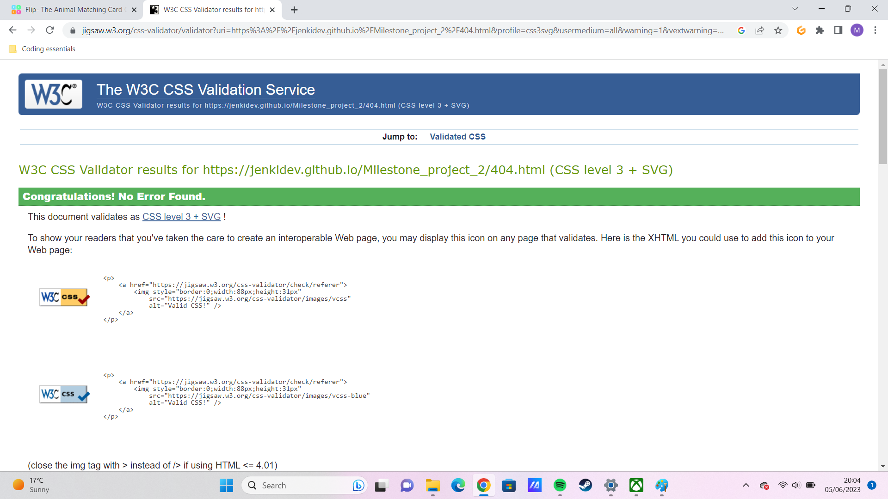
 

#### JavaScript Validation- JS hint was used to assess the validity of my scripts

JS Validation of Game Script
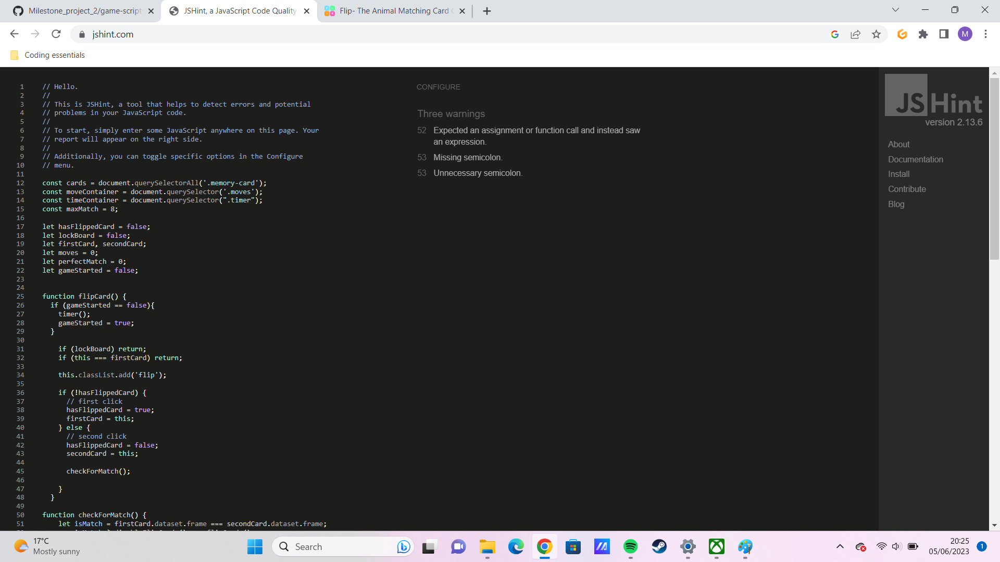
 

JS Validation of Menu Script
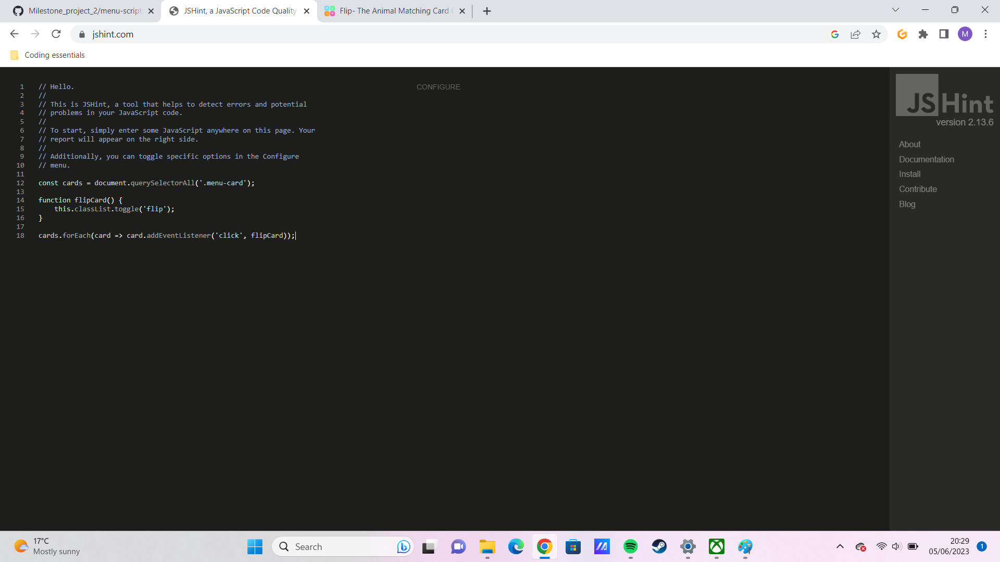
 

JS Validation of Contact Script
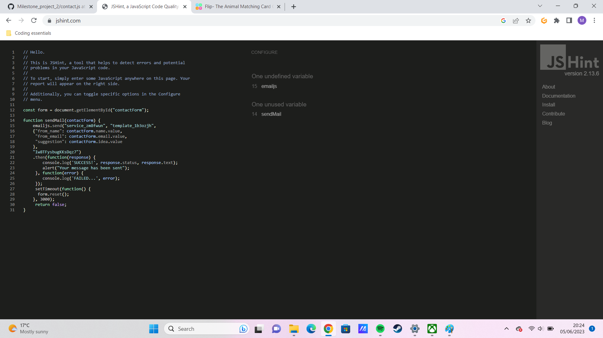
 

### Performance and Accessibility

Google Lighthouse as part of the Chrom dev tools was used to assess performance and accessibility.

Home page Performance and Accessibility

 

Game page Performance and Accessibility

The lower best practices score on the Game page is related to the images used for the flip cards. The aspect ratio needed to be changed from its original value to better fit the page. However care had been taken to ensure images are still legible and clear. 
 

Contact page Performance and Accessibility

 

404 page Performance and Accessibility

 

### Device Tests

The website was tested on the following devices:
* Samsung Galaxy M31
* iPhone 12 Pro
* Ipad Pro 4th Gen
* Asus Vivobook laptop (X515JAB_X515JA)

### Responsiveness

[Responsinator](http://www.responsinator.com/?url=jenkidev.github.io%2FMilestone_project_2%2F) was used to assess the responsiveness of the project. 

### User Story Tests

#### First-time User 
1. <strong>I want to play the Flip card memory game.</strong>

| **Feature Used** | **User Action** | **Expectation** | **Result** |
| ---------------- | --------------- | --------------- | ---------- |
| Game page, Menu cards and Nav Bar | User clicks on menu card div or Play the game link on index.html and begins game on casual-game-page.html | casual-game-page.html should open and the user should be able to start the game by clicking on the first card | Works according to expectation |

2. <strong>I want to save my result upon completion.</strong>

| **Feature Used** | **User Action** | **Expectation** | **Result** |
| ---------------- | --------------- | --------------- | ---------- |
| Game Page | Finishing the game by matching all the cards | The users number of moves and time taken are stored locally on the website and exported to a leaderboard on index.html | Had to abandon this part due to time crunch will be included in fututre versions of the site |

3. <strong>I want to see my results.</strong>

| **Feature Used** | **User Action** | **Expectation** | **Result** |
| ---------------- | --------------- | --------------- | ---------- |
| Game Page, Home Page | Flipping the Game Stats Div on index.html, Looking at the top of the casual-game-page.html in the game info bar | User can scroll through a leaderboard on index.html to see their lowest number of moves and lowest time for completing the game. User can look at top of game page to clearly see the number of moves taken and the time taken to complete game upon completion | Had to abandon leaderboard due to time crunch will be included in future versions of the site, game-info bar at top of casual-game-page.html functions as expected |

4. <strong>I want to contact the creator of the site.</strong>

| **Feature Used** | **User Action** | **Expectation** | **Result** |
| ---------------- | --------------- | --------------- | ---------- |
| Home page, Contact Us Page | User can flip contact us menu card and fill out form to be submitted with suggestions or issues, they can also access a contact page where the same form will be present | User can fill out form with Name, Email and Comments and submit that form which will then be automatically emailed to site owner via EmailJS functionality | Contact form on index.html was not reacting appropriately with the flipping social menu card so was removed, contact-page.html works as expected |

#### Returning User

5. <strong>I want to see my previous scores for all difficulty levels.</strong>

| **Feature Used** | **User Action** | **Expectation** | **Result** |
| ---------------- | --------------- | --------------- | ---------- |
| Home Page | User Should click on game stats div | User will see the lowest number of moves taken during the memory game and the shortest amount of time taken to complete | Had to abandon this part due to time crunch will be included in future versions of the site |

6. <strong>I want to be able to see if I can improve my previous score.</strong>

| **Feature Used** | **User Action** | **Expectation** | **Result** |
| ---------------- | --------------- | --------------- | ---------- |
| Home Page, Game Page | User should click on game stats div on index.html, user can also revisit casual-game-page.html | User will see the lowest number of moves taken during the memory game and the shortest amount of time taken to complete, User can replay the memory game and update their score | Had to abandon this part due to time crunch will be included in future versions of the site, replaying the game works as expected |

7. <strong>I want to be able to contact the creator of the site if I encounter any issues.</strong>

| **Feature Used** | **User Action** | **Expectation** | **Result** |
| ---------------- | --------------- | --------------- | ---------- |
| Home Page, Contact Us Page | User can flip contact us menu card and fill out form to be submitted with suggestions or issues, they can also access a contact page where the same form will be present | User can fill out form with Name, Email and Comments and submit that form which will then be automatically emailed to site owner via EmailJS functionality | Contact form on index.html was not reacting appropriately with the flipping social menu card so was removed, contact-page.html works as expected |

#### Site Owner 

8. <strong>I want users to be able to play the Flip Card game on mobile, tablet and desktop.</strong>

| **Feature Used** | **User Action** | **Expectation** | **Result** |
| ---------------- | --------------- | --------------- | ---------- |
| Game Page | User accesses game page on any device and orientation | The user should be able to clearly see all elements of the page and click or tap on them comfortably and complete the game | Works as expected |

9. <strong>I want users to be able to save their previous results for all difficulty levels.</strong>

| **Feature Used** | **User Action** | **Expectation** | **Result** |
| ---------------- | --------------- | --------------- | ---------- |
| Home Page, Game page | User can select a different difficulty level on home page, user completes game | The different level will increase or decrease the number of cards in the game thus changing difficulty, the score will be locally saved on the website | Both were scrapped. The difficulty levels were removed because changing number of cards caused issues with legibility of images especially when there were high numbers of cards. Abandoned results saving due to time crunch but will be included in future versions of the site |

10. <strong>I want users to be able to see their previous scores for all difficulty levels.</strong>

| **Feature Used** | **User Action** | **Expectation** | **Result** |
| ---------------- | --------------- | --------------- | ---------- |
| Home Page | User Should click on game stats div | User will see the lowest number of moves taken during the memory game and the shortest amount of time taken to complete | Had to abandon this part due to time crunch will be included in future versions of the site |

11. <strong>I want users to be able to contact me with suggestions and issue reports.</strong>

| **Feature Used** | **User Action** | **Expectation** | **Result** |
| ---------------- | --------------- | --------------- | ---------- |
| Contact Us Page | User can access a contact page where a form will be present to fill out | The user can provide their Name, E-mail and suggestions which upon submission will be emailed to site owner via EmailJS client | Works as expected |

12. <strong>I want users to navigate the site without using the browser back button.</strong>

| **Feature Used** | **User Action** | **Expectation** | **Result** |
| ---------------- | --------------- | --------------- | ---------- |
| Nav Bar, 404 page | Users click on parts of nav bar, users click on link in 404.html | If a user clicks on a link on the nav bar it takes them to the page they expect, if a 404 error occurs they are taken to a styled 404 page (404.html) where there is a link to direct them back to index.html | Works as expected |

## Bug Squashing

| **Bug** | **Fix** |
|---------|---------|
|On some safari devices the menu cards would not flip correctly, and the backface would disappear thus rendering the text invisible.| I was not able to completely erase this bug however I was able to eliminate the phenemenon that caused the text to disappear, it seems to be a known issue among safari's interaction with the back-face visibility property. The fix was found here: https://forum.blocsapp.com/t/css-backface-visibility-issue-solved/20229/6. Adding the webkit prefix to all properties relating to the flipping effect also did not work but once the Translate Z property was applied functionality was returned. What I beleieve happened was the front and back faces of the div occupied the same space on the z axis which once the backface-visibility property was applied hid both faces of the div. Unfortunately this seems to have removed the 3d flip effect however allowing both faces of the div to be visible and the fact this is an issue with only a small number of devices I believe this to be a successful fix for the current moment. UPDATE: Upon retesting the 3d effect appears to have been activated, not sure what caused the change but possibly related to the cache. 

## Deployment

### Deploying to GitHub Pages

To deploy the site I used github pages: 
1. In the GitHub repository, select the Settings option 
2. From the left hand menu select 'Pages'
3. From the source select the main branch
4. 'Save'
5. Once successfully deployed a clickable link will be shown.

### Forking the GitHub Repository

You can fork the repository by following these steps:
1. Go to the GitHub repository
1. Click on Fork button

### Cloning the GitHub Repository

You can clone the repository to use locally by following these steps:
1. Navigate to the GitHub Repository you want to clone
2. Click on the code drop down button
3. Click on HTTPS
4. Copy the repository link to the clipboard
5. Open your IDE of choice (git must be installed for the next steps)
6. Type git clone copied-git-url into the IDE terminal

If more information is required please consult [GitHub Docs](https://docs.github.com/en)

## Credits

* [Memory Game - Vanilla JavaScript](https://marina-ferreira.github.io/tutorials/js/memory-game/)- Code was taken and adapted from this developer to create main functionality of flipping cards in javascript.

* [Create a Simple Popup Modal](https://www.youtube.com/watch?v=gLWIYk0Sd38)- This video was used as assisstance to develop pop up modal upon game completion.

* [Blocsapp Forum](https://forum.blocsapp.com/t/css-backface-visibility-issue-solved/20229/6) and [Stack Overflow](https://stackoverflow.com/questions/42744573/backface-visibility-not-working-in-safari)- Used in solving bug relating to flipping functionality on some safari devices.

* [W3Schools](https://www.w3schools.com/css/css_grid.asp)- Used in implementing grid layout for menu section.

* AntonioRodriguez_Mentor- Big thanks to my mentor Antonio Rodriguez who assited me in developing the timer for the game.

## Thank You

* My mentor Antonio Rodriguez for his help and advice in creating this project.
* To the team at [Code Institute](https://codeinstitute.net/) for the lessons and support.
* My Partner for helping with project testing and supporting me through it.
